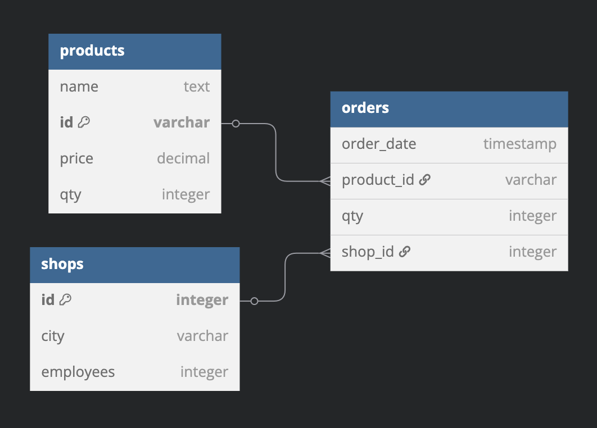

# simplon-data-brief

## Architecture du projet

Deux services:
- script_service: Exécute les scripts de manipulation/traitement data
- sqlite_service: Rend disponible les données en volume partagé

Communication:
- Pas besoin d'exposer de ports car sqlite n'est pas un serveur SQL à proprement parler; il suffira d'accéder au fichier .db mis à disposition en volume partagé
- Requêtes HTTP afin de récupérer les fichiers de données régulièrement

```bash
simplon-data-brief/
├── docker-compose.yml
├── script_service/
│   ├── Dockerfile
│   ├── schema.sql
│   ├── main.py
│   └── ...
└── shared_data/ (=sqlite_service, volume monté)
```

## Structure des tables bassée sur les données en input:

#### Schéma MCD:



#### Table `products`:
| Attribut | Type | Description |
| ------ | ------ | ------ |
| name | TEXT | Nom du produit |
| id | VARCHAR | Référence produit |
| price | DECIMAL | Prix du produit |
| qty | INTEGER | Stock initial |

#### Table `shops`:
| Attribut | Type | Description |
| ------ | ------ | ------ |
| id | INTEGER | ID du magasin |
| city | VARCHAR(255) | Ville |
| employees | INTEGER | Nombre de salariés |

#### Table `orders`
| Attribut | Type | Description |
| ------ | ------ | ------ |
| order_date | TIMESTAMP | Date de la commande |
| product_id | VARCHAR | Réf. produit (foreign key) |
| qty | INTEGER | Quantité commandée |
| shop_id | INTEGER | ID magasin (foreign key) |

## Résultats d'analyse obtenus

```bash
script_service-1  | -----
script_service-1  | Total revenue: 5268.78
script_service-1  | -----
script_service-1  | Sales by product:
script_service-1  | Product: Produit D | Units sold: 21 | Revenue: €1679.79
script_service-1  | Product: Produit E | Units sold: 35 | Revenue: €1399.65
script_service-1  | Product: Produit A | Units sold: 24 | Revenue: €1199.76
script_service-1  | Product: Produit B | Units sold: 27 | Revenue: €539.73
script_service-1  | Product: Produit C | Units sold: 15 | Revenue: €449.85
script_service-1  | -----
script_service-1  | Sales by region:
script_service-1  | Region: Lyon | Units sold: 21 | Revenue: €1059.79
script_service-1  | Region: Marseille | Units sold: 27 | Revenue: €1009.73
script_service-1  | Region: Bordeaux | Units sold: 19 | Revenue: €829.81
script_service-1  | Region: Paris | Units sold: 20 | Revenue: €799.8
script_service-1  | Region: Nantes | Units sold: 17 | Revenue: €739.83
script_service-1  | Region: Strasbourg | Units sold: 11 | Revenue: €579.89
script_service-1  | Region: Lille | Units sold: 7 | Revenue: €249.93
script_service-1  | -----
script_service-1 exited with code 0
```